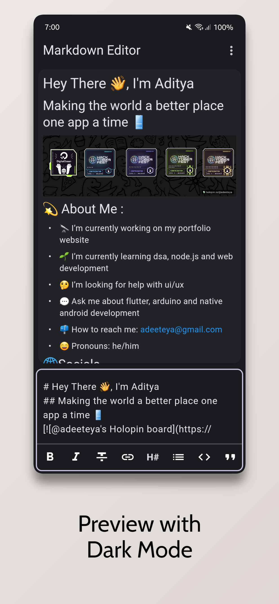
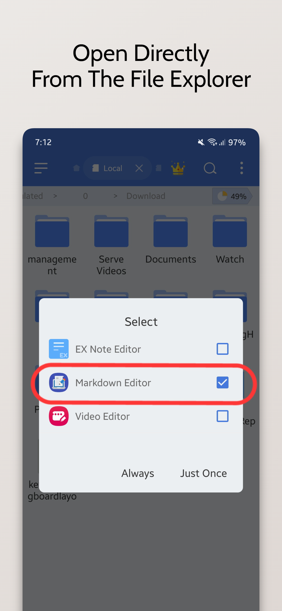

# 📝 Flutter Markdown Editor

Introducing the Markdown Editor app, the perfect tool for anyone who needs to create and edit markdown files with ease. With the ability to open ".md" files directly from the explorer, you can easily access your files and start working on them right away.

The app also offers a convenient way to style your text with options such as bold, italics, headings, and more. Adding links is also a breeze with the simple interface.

In addition, you can preview JPEG, PNG, GIF, WebP, BMP, and WBMP image formats right within the app. You can easily open links from the preview, making it easy to navigate between different files and sources.

Choose between Light and Dark Theme Modes, and use the Dual View Mode to simultaneously view both the preview and editing views. Alternatively, you can use Single View Mode to focus on either the preview or editing view.

The app also offers the ability to clear text and start from scratch, as well as create new .md files or edit existing ones.

This Editor was developed using Flutter and is mainly targeted for mobile devices as currently there aren't any standalone markdown editors available.

Please star⭐ the repo if you like what you see😊.

## 💻 Installation links

<table>
  <tr>
    <th>Platform</th>
    <th>Installation Links</th>
  </tr>
  <tr>
    <td>Android</td>
    <td>
      
       
      
       
      
    </td>
  </tr>

  <tr>
      <td>Linux</td>
      <td>
        
         
         
        
         
         
        
      </td>
  </tr>

  <tr>
      <td>Windows</td>
      <td>
        
      </td>
  </tr>

  <tr>
      <td>Web App</td>
      <td>
        
      </td>
  </tr>

</table>

## ✨ Features

- [x] Ability to open .md files directly from the explorer
- [x] Convenient way to style text (bold,italics,headings and etc)
- [x] Convenient way to add links
- [x] Convenient way to add tables
- [x] Ability to preview JPEG, PNG, GIF, WebP, BMP, and WBMP image formats.
- [x] Easily open links from the preview
- [x] Light and Dark Theme Modes available
- [x] Dual View Mode available (Both Preview and Editing View)
- [x] Single View Mode available (Either Preview or the Editing View)
- [x] Added Multi Language Support (For Some of the most popular languages of the world)
- [x] Ability to clear text and start from scratch
- [x] Create new .md files
- [x] Edit existing .md files
- [x] LaTex support
- [x] Horizontal Swipe to Switch between Preview and Editing View in Single View Mode
- [x] Default Folder for Opening and Saving .md files
- [x] Added Print/Save as Pdf Option

## 📸 Screenshots

     

## 🔌 Plugins

| Name                                                                        | Usage                                                       |
|-----------------------------------------------------------------------------|-------------------------------------------------------------|
| [**flutter_markdown**](https://pub.dev/packages/flutter_markdown)           | To render markdown text                                     |
| [**permission_handler**](https://pub.dev/packages/permission_handler)       | To get storage permissions for opening and saving .md files |
| [**url_launcher**](https://pub.dev/packages/url_launcher)                   | To launch markdown links                                    |
| [**file_picker**](https://pub.dev/packages/file_picker)                     | To open markdown files directly from the app                |
| [**expandable**](https://pub.dev/packages/expandable)                       | To create expandable header buttons                         |
| [**flutter_localizations**](https://pub.dev/packages/flutter_localizations) | Internationalizing app                                      |
| [**intl**](https://pub.dev/packages/intl)                                   | Provides internationalization and localization facilities   |
| [**flutter_lints**](https://pub.dev/packages/flutter_lints)                 | For linting                                                 |

## 🤓 Author

**[Aditya R](https://github.com/adeeteya)**

## 🔖 LICENCE
Copyright (c) 2023 Aditya R
[MIT LICENCE](https://github.com/adeeteya/FlutterMarkdownEditor/blob/master/LICENSE)

## 🙏 Attributions
<a href="https://www.flaticon.com/free-icons/text-editor" title="text editor icons">Text Editor icons created by Freepik - Flaticon</a>
